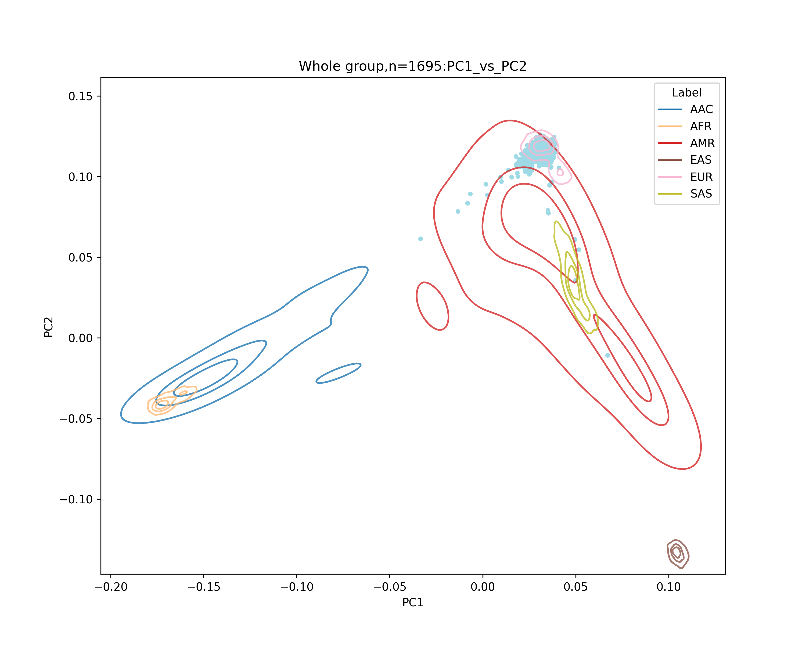
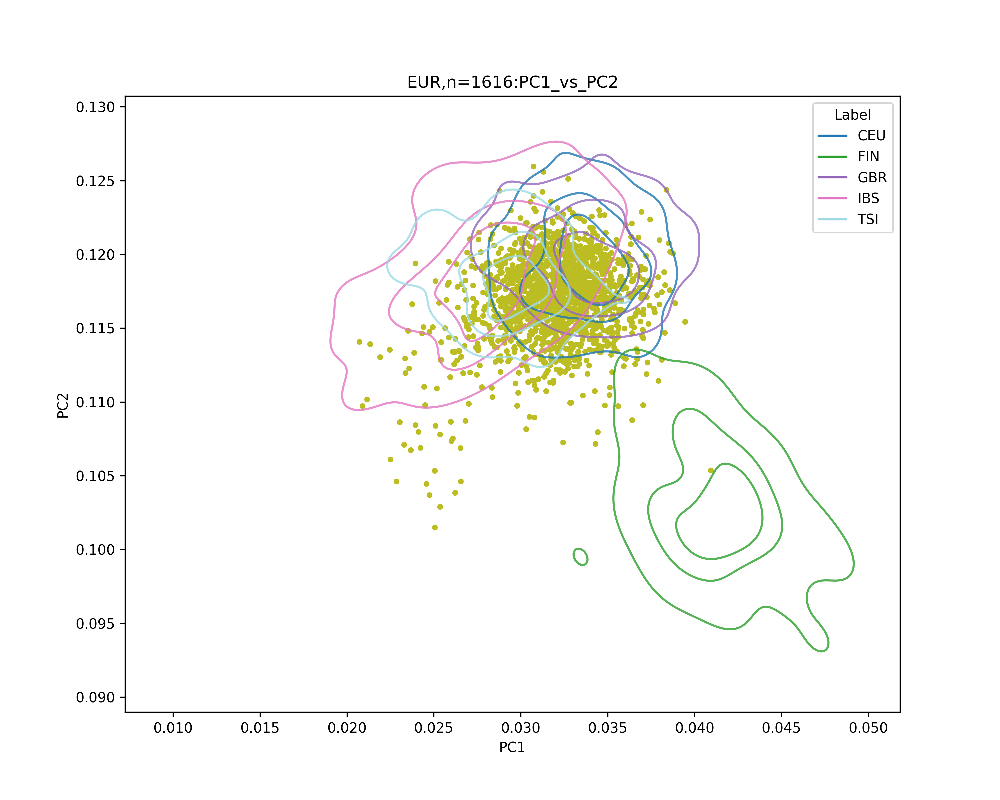
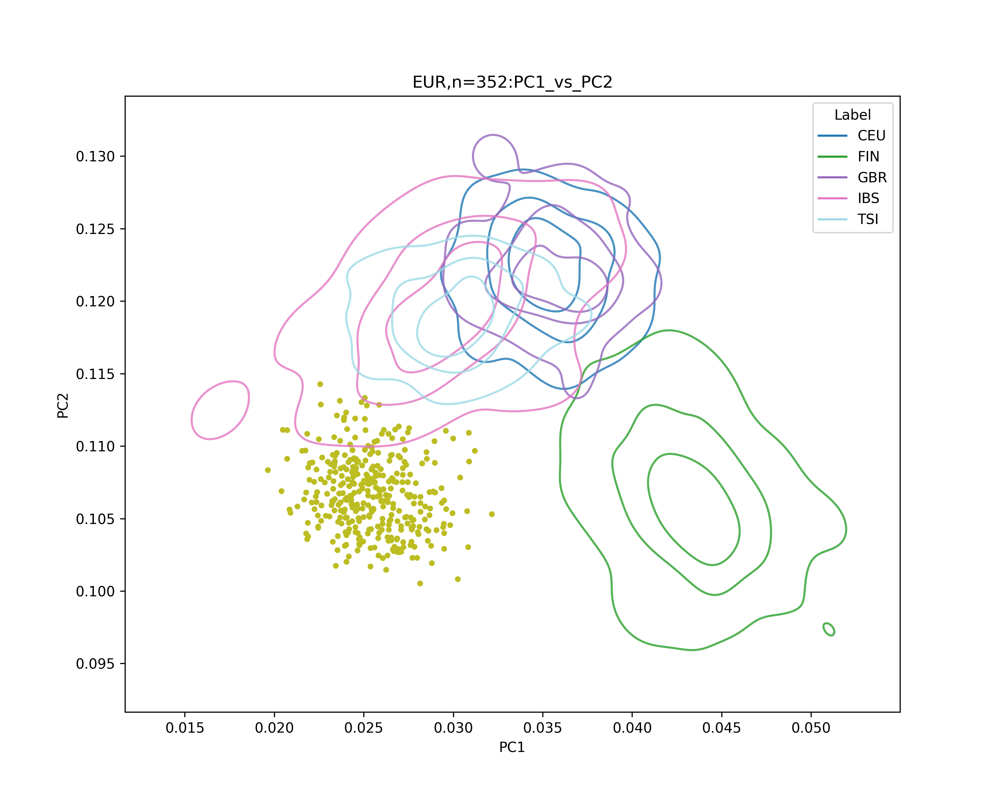
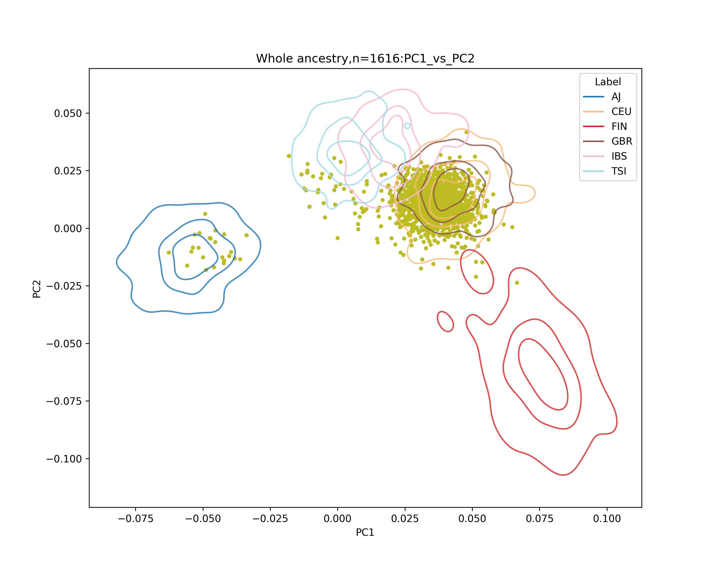

# REGARDS genetic QC and population splitting

Install plink2 to ./bin folder `PLINK v2.0.0-a.7LM 64-bit Intel (1 Sep 2025)`
```
wget -O ./bin/plink2.zip https://s3.amazonaws.com/plink2-assets/plink2_linux_x86_64_latest.zip && unzip -o ./bin/plink2.zip -d ./bin && chmod +x ./bin/plink2
```

Install modules to run the following scripts on cluster
```
module load ucsc #for liftOver
module load plink/1.9
```
## Required references
* hg19ToHg38.over.chain.gz
* hg18ToHg38.over.chain.gz
* hg38ToHg19.over.chain.gz
* hg38.fa.gz
* hg38.fa.gz.fai
* Qced 1kg plink binary + population labels (all_hg38_filtered_chrpos*)
* AJ reference plink binary from [GSE23636](https://www.ncbi.nlm.nih.gov/geo/query/acc.cgi?acc=GSE23636)


\* biallelic snps on autosomes with a MAF > 0.01, geno > 0.95 and hwe > 1e-6. Also, pallindromes and long LD regions were excluded. ([Processing steps](https://github.com/hirotaka-i/1kg_ref/blob/main/main.ipynb))

## EUR
Start with REGARDS EUR genotyping data.    

First, clean-up the noisy variants, align to hg38, standardize the variants IDs to chr:pos:ref:alt
```
bash code/01_prepare_variants.sh \
        --bfile /data/CARD/AD/REGARDS/Genetics/old_files/REGARDS_EUR_Genotyped \
        --fa data/hg38.fa.gz \
        --chain data/hg19ToHg38.over.chain.gz \
        --chain-back data/hg38ToHg19.over.chain.gz \
        --outdir temp/EUR/prep_vars_out \
        --threads 2
```
sample QCs (call rate, sex, heterozygosity, relatives)
```
bash code/02_qc_samples.sh \
        --pfile temp/EUR/prep_vars_out/hg38_prepped \
        --outdir temp/EUR/qc_samples_out \
        --threads 2
```
Population splitting (Map study samples to 1kg reference panel PC projection)
```
bash code/03_pca_with_ref_score.sh \
        --study-pfile temp/EUR/qc_samples_out/final_keep \
        --ref-bfile data/all_hg38_filtered_chrpos \
        --fa data/hg38.fa.gz \
        --drop-ambig yes \
        --outdir temp/EUR/merge_ref_proj_out \
        --threads 2
python code/03b_plot_pop_and_split.py \
        --pc-prefix temp/EUR/merge_ref_proj_out/study_vs_ref.combined \
        --ref-label data/all_hg38_filtered_chrpos_pop.txt \
        --ref-label-col Population \
        --split-method mahalanobis \
        --out-prefix temp/EUR/pop_split_out/with_1kg_mah
```
```
InfPop
REF      2573
EUR      1616
AMR        68
OTHER      11
```

Output figures are in `temp/EUR/pop_split_out`




## Try separating AJ
GP2 style requires AJ separation from EUR. 
### First, merging AJ with 1kg
```
bash code/01_prepare_variants.sh \
        --bfile data/GSE23636 \
        --fa data/hg38.fa.gz \
        --chain data/hg18ToHg38.over.chain.gz \
        --outdir temp/AJ/prep_vars_out \
        --threads 2
```
```
bash code/02_qc_samples.sh \
        --pfile temp/AJ/prep_vars_out/hg38_prepped \
        --outdir temp/AJ/qc_samples_out \
        --threads 2
```
```
bash code/03_pca_with_ref_score.sh \
        --study-pfile temp/AJ/qc_samples_out/final_keep \
        --ref-bfile data/all_hg38_filtered_chrpos \
        --fa data/hg38.fa.gz \
        --drop-ambig yes \
        --outdir temp/AJ/merge_ref_proj_out \
        --threads 2
python code/03b_plot_pop_and_split.py \
        --pc-prefix temp/AJ/merge_ref_proj_out/study_vs_ref.combined \
        --ref-label data/all_hg38_filtered_chrpos_pop.txt \
        --ref-label-col Population \
        --split-method mahalanobis \
        --out-prefix temp/AJ/pop_split_out/with_1kg_mah
```
```
InfPop
REF      2573
EUR       352
AMR        79
OTHER      32
```
Some AJ participants were not-mapped to AJ cluster when merged with 1kg.

Output figures are in `temp/AJ/pop_split_out`



make a ref dataset for AJ/EUR+1kg/EUR
```
python code/make_aj_1kg_list.py
./bin/plink2 --bfile temp/AJ/merge_ref_proj_out/merged_temp \
        --keep temp/AJ/aj_1kg_eur.list \
        --make-bed --threads 2 \
        --out temp/AJ/ref_aj_eur
```
Combine with EUR samples and plot
```
bash code/03_pca_with_ref_score.sh \
        --study-pfile temp/EUR/qc_samples_out/final_keep \
        --keep-sample temp/EUR/pop_split_out/with_1kg_mah_EUR.list \
        --ref-bfile temp/AJ/ref_aj_eur \
        --fa data/hg38.fa.gz \
        --maf 0.05 \
        --drop-ambig yes \
        --outdir temp/EUR/merge_refaj_proj_out \
        --threads 2
python code/03b_plot_pop_and_split.py \
        --pc-prefix temp/EUR/merge_refaj_proj_out/study_vs_ref.combined \
        --ref-label temp/AJ/aj_1kg_eur_label.list \
        --ref-label-col label \
        --split-method mahalanobis \
        --eur-aj-sep \
        --out-prefix temp/EUR/pop_split_eur_out/with_1kg_aj_mah
```
```
InfPop
EUR-nonAJ    1592
REF           877
EUR-AJ         24
```
Output figures are in `temp/EUR/pop_split_eur_out`



* EUR list: `temp/EUR/pop_split_eur_out/with_1kg_mah_EUR.list`
* EUR-nonAJ list: `temp/EUR/pop_split_eur_out/with_1kg_aj_mah_EUR-nonAJ.list`

---

# Preparation for Imputation server
*Under construction*
* Variants QC (+high call rate filtering) after population split
* Run HRC-1000G-check-bim
* split VCF by chromosome and bgzip + tabix
--> Upload to Michigan Imputation server / TopMed Imputation server
