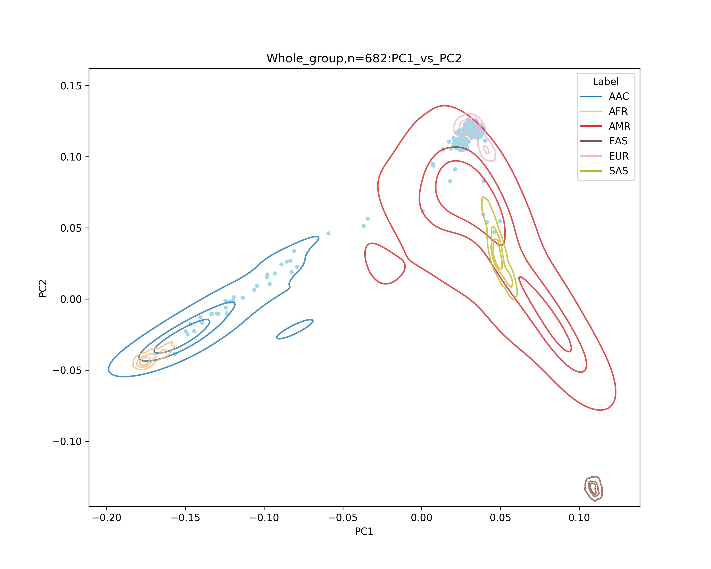
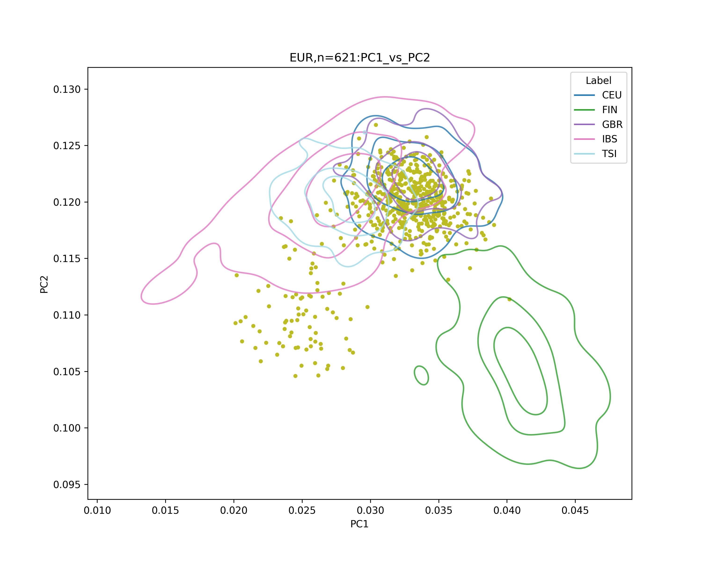

# ADNI1 genetic QC and population splitting

ADNI1 genotying data is using the Illumina Human610-Quad BeadChip and intensity data processed with GenomeStudio v2009.1

It is aligned to hg18, but the position is a bit different from hg18 FASTA file. Also it is not standardized to the forward strand. For example, this variant's Reference allele is A. Also the position is diffrent from any of the hg18/19/38 standard coordinates.
```
1       rs3737728       0       1011278 T       C
```
When aligned to rsID (not on chr:pos), still the imputation server reports around 10% strand flip and 5% strand flip & allele swap. 85% are almost 100% matched so we see this as stranad / allele mis-alignment issue on rsID.

In summarize, our approach is to:
* use rsID to retrive the standardized coordinates
* do ordinary QCs
* use HRC-1000 to standardize to forward strand

## Preparation
Install plink2 to ./bin folder `
```
mkdir -p ./bin
wget -O ./bin/plink2.zip https://s3.amazonaws.com/plink2-assets/plink2_linux_x86_64_latest.zip && unzip -o ./bin/plink2.zip -d ./bin && chmod +x ./bin/plink2
```
Download chain file for liftOver
```
wget -O data/hg18ToHg38.over.chain.gz http://hgdownload.soe.ucsc.edu/goldenpath/hg18/liftOver/hg18ToHg38.over.chain.gz
````
Install modules to run the following scripts on cluster
```
module load ucsc #for liftOver
module load plink/1.9
```
## Required references
* hg38.fa.gz (fasta file) from [UCSC](https://hgdownload.cse.ucsc.edu/goldenpath/hg38/bigZips/)
* AJ reference plink binary from [GSE23636](https://www.ncbi.nlm.nih.gov/geo/query/acc.cgi?acc=GSE23636)
* 1000 genome phase 3 plink binary + population labels filtered to biallelic snps on autosomes with a MAF > 0.01, geno > 0.95 and hwe > 1e-6. Also, pallindromes and long LD regions were excluded. ([Processing steps](https://github.com/hirotaka-i/1kg_ref/blob/main/main.ipynb))

## Retrieve standardized positions on hg19 from rsID
Start with removing the noisy variants from the original ADNI1 hg18 data. Then, align to hg19 positions using rsID and HapMap map file.
```
awk '$5 == "0" || $6 == "0" || $5 == $6 {print $2}' \
  ../resources/ADNI/ADNI1_hg19/ADNI_cluster_01_forward_757LONI.bim \
  > temp/bad_snps.txt

./bin/plink2 \
  --bfile ../resources/ADNI/ADNI1_hg19/ADNI_cluster_01_forward_757LONI \
  --exclude temp/bad_snps.txt \
  --make-bed \
  --out temp/ADNI_start
```
Retrieve hg19 positions from rsID using HapMap map file
```
awk '$2 ~ /^rs[0-9]+$/ {print $2}' temp/ADNI_start.bim \
  | sort -u > temp/adni_rsid.sorted
join -t $'\t' -1 1 -2 1 \
  temp/adni_rsid.sorted \
  ../resources/HAPMAP_hg19_new.map.sorted.pref_exact \
  > temp/adni_rsid_to_hg19.map

awk '{print $1, $2}' temp/adni_rsid_to_hg19.map > temp/update_chr_hg19.txt
awk '{print $1, $3}' temp/adni_rsid_to_hg19.map > temp/update_pos_hg19.txt
cut -f1 temp/adni_rsid_to_hg19.map > temp/rsids_with_hg19pos.txt
```
* 587337 temp/adni_rsid.sorted 
* 417147 temp/adni_rsid_to_hg19.map
```
awk '{print $1, $2}' temp/adni_rsid_to_hg19.map > temp/update_chr_hg19.txt
awk '{print $1, $3}' temp/adni_rsid_to_hg19.map > temp/update_pos_hg19.txt
cut -f1 temp/adni_rsid_to_hg19.map > temp/rsids_with_hg19pos.txt
```

```
./bin/plink2 \
  --bfile temp/ADNI_start \
  --extract temp/rsids_with_hg19pos.txt \
  --update-chr temp/adni_rsid_to_hg19.map \
  --update-map temp/adni_rsid_to_hg19.map 3 1 \
  --sort-vars \
  --make-pgen \
  --out temp/ADNI_hg19_rsidpos
```

# QC and population splitting pipeline
```
bash code/01_prepare_variants.sh \
        --pfile temp/ADNI_hg19_rsidpos \
        --fa ../resources/liftover_ref/hg38.fa.gz \
        --chain data/hg19ToHg38.over.chain.gz \
        --chain-back data/hg38ToHg19.over.chain.gz \
        --outdir temp/prep_vars_out \
        --threads 2
```
sample QCs (call rate, sex, heterozygosity, relatives)
```
bash code/02_qc_samples.sh \
        --pfile temp/prep_vars_out/hg38_prepped \
        --outdir temp/qc_samples_out \
        --threads 2
```
Population splitting (Map study samples to 1kg reference panel PC projection)
```
bash code/03_pca_with_ref_score.sh \
        --study-pfile temp/qc_samples_out/final_keep \
        --ref-bfile ../resources/1kg_p3/all_hg38_filtered_chrpos \
        --fa ../resources/liftover_ref/hg38.fa.gz \
        --drop-ambig yes \
        --outdir temp/merge_ref_proj_out \
        --threads 2
python code/03b_plot_pop_and_split.py \
        --pc-prefix temp/merge_ref_proj_out/study_vs_ref.combined \
        --ref-label ../resources/1kg_p3/all_hg38_filtered_chrpos_pop.txt \
        --ref-label-col Population \
        --split-method mahalanobis \
        --out-prefix temp/pop_split_out/with_1kg_mah
```
```
InfPop
EUR       637
AAC        32
AMR        25
OTHER      11
SAS         1
```

Output figures are in `temp/pop_split_out`



# Separate EUR and prep for imputation
```
bash code/04_qc_split.sh \
  --pfile temp/prep_vars_out/hg38_prepped \
  --keep-samples temp/pop_split_out/with_1kg_mah_EUR.list \
  --fa ../resources/liftover_ref/hg38.fa.gz \
  --snps-only yes \
  --vcf-out no \
  --outdir temp/qc_EUR_splitted \
  --geno-thres 0.1 \
  --maf-thres 0.005 \
  --threads 2
```


## Strand alignement
```
mkdir -p temp/strand_align

# Get freq + bim files
./bin/plink2 \
  --pfile temp/qc_EUR_splitted/kept_snps_qc \
  --keep-allele-order \
  --make-bed \
  --out temp/strand_align/kept_snps_qc
plink --bfile temp/strand_align/kept_snps_qc \
  --keep-allele-order \
  --freq \
  --out temp/strand_align/kept_snps_qc

perl ../resources/strand_check/HRC-1000G-check-bim.pl \
  -b temp/strand_align/kept_snps_qc.bim \
  -f temp/strand_align/kept_snps_qc.frq \
  -r ../resources/strand_check/PASS.Variantsbravo-dbsnp-all.tab.gz \
  -h -o temp/strand_align/strand_check_run

bash temp/strand_align/strand_check_run/Run-plink.sh 
```
# Compress VCFs and tar.gz them for upload
```
gzip temp/strand_align/strand_check_run/kept_snps_qc-updated-chr*.vcf
tar -czvf temp/preimpute_vcf.tar.gz temp/strand_align/strand_check_run/kept_snps_qc-updated-chr*.vcf.gz
```

--> TOPMed Imputation server.